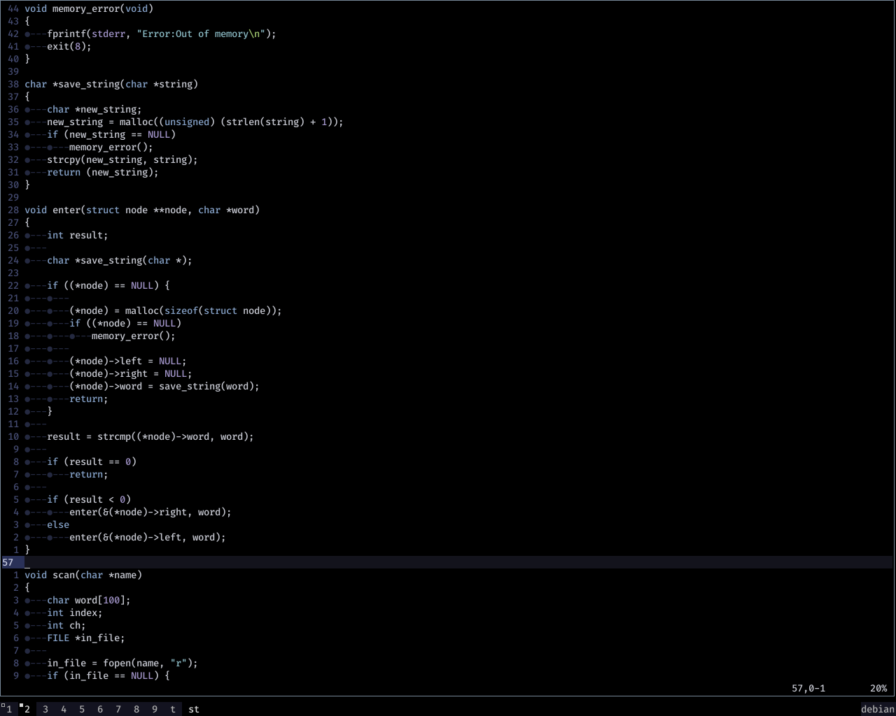
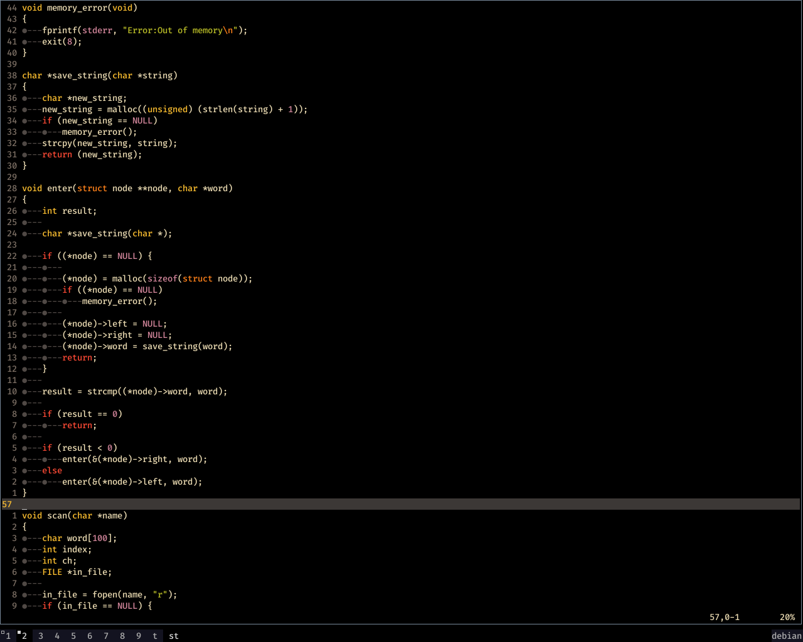

### Vim colorschemes but with pitch-black background

To match the whole dark scheme of my work space, I made some modifications to a few vim colorschemes that I use on a daily basis to have a complete pitch black background. Colorschemes modified are;

* Iceberg

* Gruvbox

* Gruvbox-material

* Substrata

## Screenshots






## Patch changes in-case you have the default colorschemes

It's makes sense to use the `patch` command to apply changes if you happen to have these colorschemes prior, rather than doing it by hand, for example, to patch iceberg.vim, you'd have to `diff` the changes to a file, say iceberg.diff, like so;

```sh
diff -u iceberg.vim iceberg-dark.vim > /path/to/iceberg.diff
```

Then, apply the patches with;

```sh
patch < /path/to/iceberg.diff
```

## Replacing gruvbox-material

The gruvbox-material has to be placed in two places, one under the plugin directory and one with regular colorschemes. The `gruvbox_material.vim` needs to be placed under plugins directory, and the `gruvbox-material.vim` with the regular colorschemes under `/usr/share/vim/vim81/colors/`

Enjoy!

Feel free to support with [bitcoin] 13erq7DDXDuqqBohht3UNyuJCXtpJcWGSe
